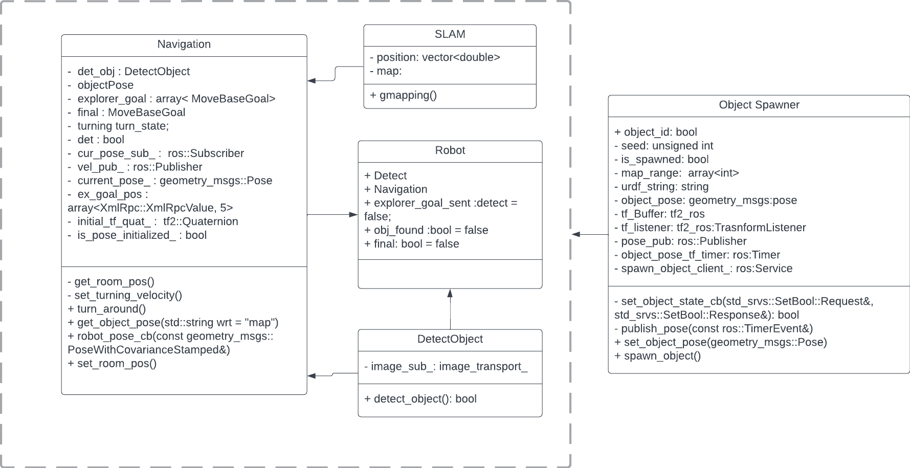

# Wall-E

[](https://opensource.org/licenses/MIT)
[](https://github.com/shaileshpranav/Wall-E/actions/workflows/CI.yml)
[](https://coveralls.io/github/shaileshpranav/Wall-E?branch=main)

**Course:** Software Development for Robotics  
**Code:** ENPM808X  
**Project No:** Final Project
**Semester:** Fall 2022  
**School:** A. James Clark School of Engineering, University of Maryland  

## Overview

This project aims to design and simulate a trash collection robot. The robot will aim to be capable of detecting and collecting trash as well as navigating an unknown simulated office environment.

## Authors
- [Shailesh Pranav Rajendran](https://github.com/shaileshpranav)
- [Harika Pendli](https://github.com/)
- [Aman Sharma](https://github.com/amancodeblast)


## License
```
MIT License

Copyright (c) 2022 Shailesh Pranav Rajendran

Permission is hereby granted, free of charge, to any person obtaining a copy
of this software and associated documentation files (the "Software"), to deal
in the Software without restriction, including without limitation the rights
to use, copy, modify, merge, publish, distribute, sublicense, and/or sell
copies of the Software, and to permit persons to whom the Software is
furnished to do so, subject to the following conditions:

The above copyright notice and this permission notice shall be included in all
copies or substantial portions of the Software.

THE SOFTWARE IS PROVIDED "AS IS", WITHOUT WARRANTY OF ANY KIND, EXPRESS OR
IMPLIED, INCLUDING BUT NOT LIMITED TO THE WARRANTIES OF MERCHANTABILITY,
FITNESS FOR A PARTICULAR PURPOSE AND NONINFRINGEMENT. IN NO EVENT SHALL THE
AUTHORS OR COPYRIGHT HOLDERS BE LIABLE FOR ANY CLAIM, DAMAGES OR OTHER
LIABILITY, WHETHER IN AN ACTION OF CONTRACT, TORT OR OTHERWISE, ARISING FROM,
OUT OF OR IN CONNECTION WITH THE SOFTWARE OR THE USE OR OTHER DEALINGS IN THE
SOFTWARE.
```


## UML Diagram


## Docments Deliverables
1. [Project Proposal](assests/Final_808X_proposal.pdf)

2. [AIP Sheet](https://docs.google.com/spreadsheets/d/1XeTO0CUpv6UCy624VYsgb07ksButBDdTZqp0TRLlJ4I/edit?usp=sharing) 

3. [Sprint Sheet](https://docs.google.com/document/d/11cLR52aRCAyYz1M3-HGVqCmaej5kUB9rt5mzMqc03yA/edit?usp=sharing)

## Dependencies
- [Ubuntu 20.04]()
- [ROS Noetic](http://wiki.ros.org/melodic/Installation/Ubuntu)
- [Gazebo](http://gazebosim.org/)
- [Opencv](https://github.com/opencv/opencv)

## Design and Development Process

We will be making use of ESC methodology for the initial design process which is by extraction of significant concepts. We identified the flow of the future program. Our software team worked on this project through iterative software evolution and service processes. Agile Development Process has been used in the development process with Test-Driven Development. 

Being a team of three programmers, we have decided to adopt pair programming roles:driver and navigator, along with a design keeper role.

## Build
- Create a workspace
```
mkdir -p ~/ros_ws/src
cd ~/ros_ws/src
```
- Clone the repository
```
git clone https://github.com/shaileshpranav/Wall-E.git
```
- Install dependencies
```
cd Wall-e
. install.bash
```
- Build the workspace
```
cd ~/ros_ws/src
catkin_make
source devel/setup.bash
```

## Launch
- Launch the simulation using Gazebo and Rviz
```
roslaunch wall-e simulation.launch
```

- To launch SLAM pipeline
```
roslaunch wall-e start_mapping.launch
```

- To Launch the simulation and to record a bag file 
```
roslaunch wall-e simulation.launch record_bag:=true
```

## Tests
To Build the Tests using catkin_make run following command in your catkin workspace.
```
catkin_make tests
```

To run the test execute following command.
```
rostest wall-e main_test.test
```
## Known Issues/Bugs
* In some cases the robot goes spinning without a stop. This behaviour can be fixed by trying different searching patterns. 

## Risks and Mitigation
* If there is any sudden movement, mapping and localisation will be not as good as it is suppose to be.
* A robost system Detect

## Assumptions
* The obstacles will be satatic. 
* All the trash will be a purple box. 
* The size of the transh will also be same almost always
