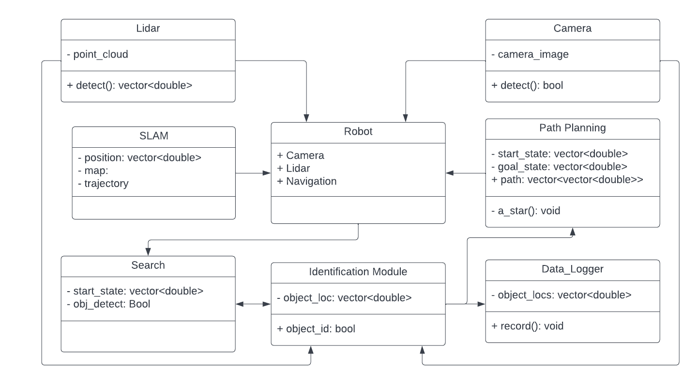

# Wall-E

[](https://opensource.org/licenses/MIT)


**Course:** Software Development for Robotics  
**Code:** ENPM808X  
**Project No:** Final Project
**Semester:** Fall 2022  
**School:** A. James Clark School of Engineering, University of Maryland  

## Overview

This project aims to design and simulate a trash collection robot. The robot will aim to be capable of detecting and collecting trash as well as navigating an unknown simulated office environment.

## Authors
- [Shailesh Pranav Rajendran](https://github.com/shaileshpranav)
- [Harika Pendli](https://github.com/)
- [Aman Sharma](https://github.com/amancodeblast)


## License
```
MIT License

Copyright (c) 2022 Shailesh Pranav Rajendran

Permission is hereby granted, free of charge, to any person obtaining a copy
of this software and associated documentation files (the "Software"), to deal
in the Software without restriction, including without limitation the rights
to use, copy, modify, merge, publish, distribute, sublicense, and/or sell
copies of the Software, and to permit persons to whom the Software is
furnished to do so, subject to the following conditions:

The above copyright notice and this permission notice shall be included in all
copies or substantial portions of the Software.

THE SOFTWARE IS PROVIDED "AS IS", WITHOUT WARRANTY OF ANY KIND, EXPRESS OR
IMPLIED, INCLUDING BUT NOT LIMITED TO THE WARRANTIES OF MERCHANTABILITY,
FITNESS FOR A PARTICULAR PURPOSE AND NONINFRINGEMENT. IN NO EVENT SHALL THE
AUTHORS OR COPYRIGHT HOLDERS BE LIABLE FOR ANY CLAIM, DAMAGES OR OTHER
LIABILITY, WHETHER IN AN ACTION OF CONTRACT, TORT OR OTHERWISE, ARISING FROM,
OUT OF OR IN CONNECTION WITH THE SOFTWARE OR THE USE OR OTHER DEALINGS IN THE
SOFTWARE.
```


## UML Diagram


## Docments Deliverables
1. [Project Proposal](assests/Final_808X_proposal.pdf)
<!-- 
2. [Quad Chart](submission/quad_chart/Quad%20Chart.pdf)

3. [Class Diagram](submission/uml/Class%20Dependancy.png) -->


2. [AIP Sheet](https://docs.google.com/spreadsheets/d/1XeTO0CUpv6UCy624VYsgb07ksButBDdTZqp0TRLlJ4I/edit?usp=sharing) 

3. [Sprint Sheet](https://docs.google.com/document/d/11cLR52aRCAyYz1M3-HGVqCmaej5kUB9rt5mzMqc03yA/edit?usp=sharing)

## Dependencies
- Ubuntu 20.04
- ROS1 Noetic

## Build
- Create a workspace
```
mkdir -p ~/ros2_ws/src
cd ~/ros2_ws/src
```
- Clone the repository
```
git clone https://github.com/shaileshpranav/Wall-E.git
```
- Build the workspace
```
cd ~/ros2_ws/src
colcon build --packages-select beginner_tutorials
cd .. && . install/setup.bash
```
